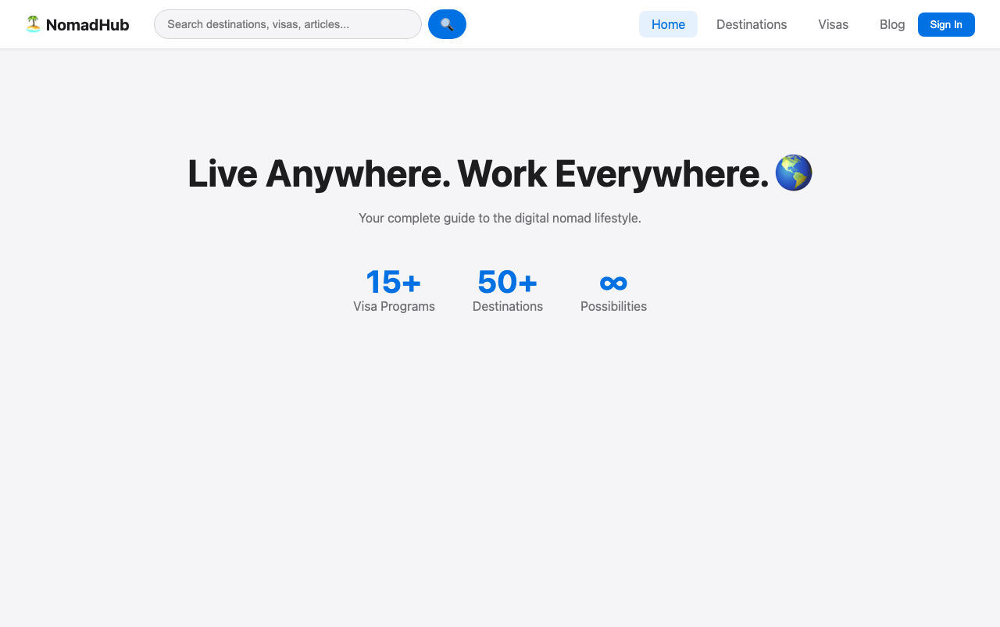

# NomadHub

NomadHub is a digital-nomad city guide. It lists a handful of destinations with cost, internet, weather, pros and cons, reviews and tips, a short blog, a visa lookup, a cost calculator, user accounts with favorites and friends, and a global search. The backend is a single-binary Rust API on Fly.io backed by SQLite; the front end is a SvelteKit app on Vercel.



## Live

- Site: https://nomadic-hub.vercel.app
- API: https://nomadic-hub.fly.dev (try `/api/destinations`)

## Architecture

```
  Browser
    |
    v
  Vercel  (nomadic-site, SvelteKit 2 / Svelte 5, adapter-vercel)
    |  fetch(`${VITE_API_URL}/api/...`)  (JSON, Bearer JWT for user routes)
    v
  Fly.io  (nomadic-api, Rust / axum 0.7 / tokio, one machine, port 3000)
    |
    +--> SQLite file via rusqlite (DATABASE_PATH, /app/nomadic.db in the image)
    |
    +--> api.open-meteo.com            GET /api/destinations/:id/weather/live
    +--> nominatim.openstreetmap.org   POST /api/auth/validate-location
    +--> api.dicebear.com              avatar URLs for demo users
```

The API is one `src/main.rs`. It creates the schema and seeds destinations, blog posts, visas and domains on first start when the tables are empty, issues JWTs (bcrypt password hashes, `jsonwebtoken`), and allows any CORS origin. The SvelteKit app is a client-rendered UI; it also ships two `+server.ts` routes with static sample data under `src/routes/api/`, but the pages call the Rust API for the same data.

## Repository layout

```
nomadic-api/          Rust API
  src/main.rs         routes, models, schema, seed data (~2500 lines)
  Cargo.toml          axum, tokio, rusqlite (bundled), bcrypt, jsonwebtoken, reqwest
  Dockerfile          two-stage build, debian:bookworm-slim runtime
  fly.toml            Fly.io app config (app "nomadic-hub", region iad)
  railway.toml        leftover from an earlier Railway deploy
  DATA_SOURCES.md     research notes on data providers (cost, internet, weather...)
nomadic-site/         SvelteKit front end
  src/routes/         +page.svelte (home, tabs), destination/[id], blog/[id],
                      friends, profile, api/domains, api/visas
  src/lib/            auth store (auth.ts), API base URL (index.ts), Search component
docs/                 screenshot used by this README
```

## API overview

All routes are under `/api`. User routes take `Authorization: Bearer <jwt>`.

| Group | Routes |
|-------|--------|
| Auth | `POST auth/register`, `auth/login`, `auth/me`, `auth/profile`, `auth/password`, `auth/validate-location`, `auth/dashboard`, `auth/reset-password` |
| Destinations | `GET destinations`, `destinations/search`, `destinations/:id`, `:id/full`, `:id/weather`, `:id/weather/live`, `:id/pros`, `:id/cons`, `:id/reviews`, `:id/user-reviews`, `:id/tips`; `POST :id/review`, `:id/tip` |
| Content | `GET blog`, `blog/:id`, `visas`, `domains`; `POST domains/check` |
| User data | `GET favorites`; `POST favorites/add`, `favorites/remove`; `POST newsletter`; `POST calculator` |
| Friends | `GET friends`, `friends/requests`, `users?q=`; `POST friends/add`, `friends/accept`, `friends/decline`, `friends/remove` |
| Search | `GET search?q=` (destinations, visas, blog) |
| Demo | `POST demo/users` (creates sample accounts) |

The full route table is at the bottom of `nomadic-api/src/main.rs`.

## Run locally

### API

```bash
cd nomadic-api
cargo run
# Database initialized at .../nomadic-api/nomadic.db
# Server running on http://0.0.0.0:3000
```

Environment variables (both optional):

| Variable | Default | Purpose |
|----------|---------|---------|
| `DATABASE_PATH` | `nomadic.db` next to `Cargo.toml` | SQLite file; created and seeded if missing |
| `PORT` | `3000` | Listen port |

The JWT signing key is a constant in `main.rs`, not an environment variable. Change it before exposing the API to anyone.

### Site

```bash
cd nomadic-site
pnpm install
pnpm dev          # http://localhost:5173
pnpm check        # svelte-check
pnpm build        # production build (adapter-vercel)
```

Environment variables:

| Variable | Default | Purpose |
|----------|---------|---------|
| `VITE_API_URL` | `http://localhost:3000` | Base URL of the API, read at build time |

## Deploy

### API on Fly.io

```bash
cd nomadic-api
fly deploy
```

`fly.toml` builds the Dockerfile, serves on internal port 3000, forces HTTPS, and lets the single shared-CPU machine stop when idle (first request after a pause takes a few seconds). The image sets `DATABASE_PATH=/app/nomadic.db`. The current `fly.toml` declares no `[mounts]` volume, so the database lives on the machine's root filesystem and is reseeded whenever the machine is rebuilt. An earlier revision (commit `81978f5`) mounted a Fly volume at `/data` and set `DATABASE_PATH=/data/nomadic.db`; restore that block if you want user accounts and reviews to survive deploys.

### Site on Vercel

Import the repo in Vercel with root directory `nomadic-site`. Set `VITE_API_URL=https://nomadic-hub.fly.dev` in the project's environment variables. The build uses `@sveltejs/adapter-vercel`; `pnpm build` is the default command.

## Status

Personal side project. The data is seeded by hand for ten cities (Lisbon, Barcelona, Bali, Mexico City, Medellin, Chiang Mai, Berlin, Tallinn, Cape Town, Dubai), six blog posts and fifteen visa programs. Only the weather and location-validation endpoints call external services. `nomadic-api/DATA_SOURCES.md` lists the providers considered for real data.
